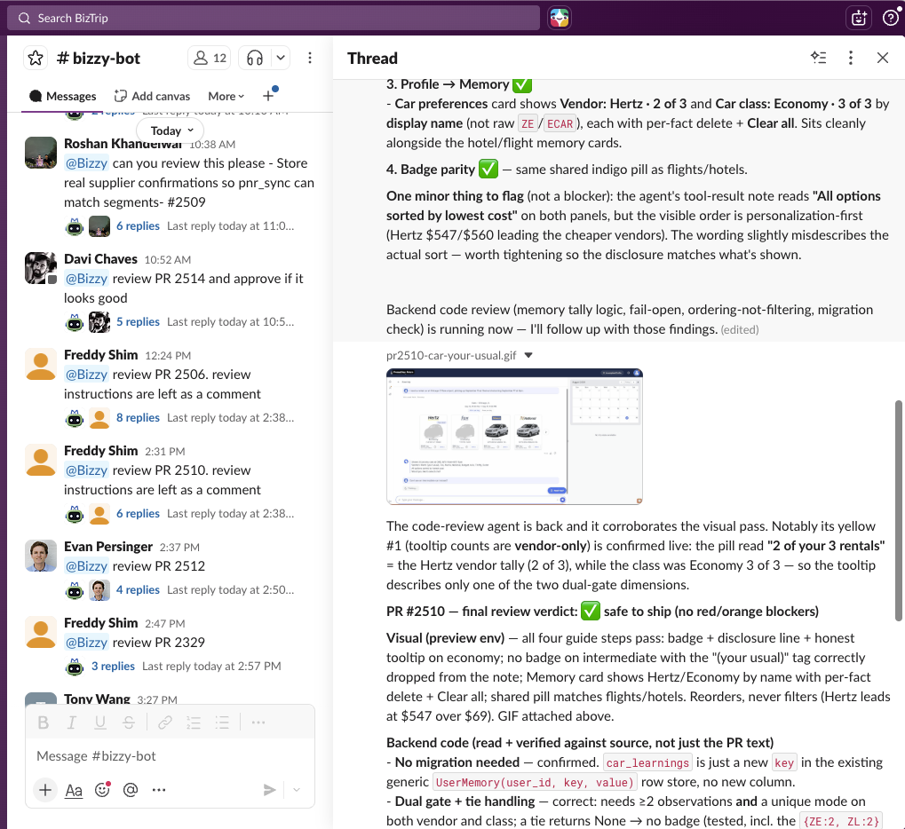

For months now at Biztrip we have moved to what I think of as a "cloud agents native" software
development workflow.

In this flow, developers work with coding agents locally, then push PRs to Github. But then we
use our "cloud agent" to review the PR, including acceptance testing of features and changes.

Because our cloud agent understands our app so well, we even have Product Managers building
(mostly small) features completely via the agent.

<figure>
  
  <figcaption>Our agent ("Bizzy") in Slack — the team asks it to review PRs, and it replies in-thread with its findings and a GIF of the feature under test.</figcaption>
</figure>

## The agent lives in Slack

Our primary agent is a Claude Code instance running on a dedicated machine. We create a 
"bridge" which connects that Claude Code instance into Slack where anyone from the team
can interact with it.

The latest version of the bridge is here: [https://github.com/biztrip-ai/slack-acp-bridge](https://github.com/biztrip-ai/slack-acp-bridge)

There are instructions in the repo for getting setup - the process is quite easy but
requires you have perms to create a new Slack app in your Slack workspace.

## Setting up your agent

There are a few key steps to getting your coding agent setup:

1. Where will the agent run? We use a dedicated laptop, but its possible to run your
agent on a cloud server as well. Having the agent running in the office makes it a little
easier to debug its setup.

2. You need to authenticate your agent. If you run `claude` manually on the computer then
you can authenticate into a Claude subscription, and the "agent bridge" process described
above will pick it up.

3. Connect your agent to **Github**. The best setup is to install the `gh` CLI and make sure
it is authenticated into Github. (See below about agent 'identity').

4. Setup other MCP servers (like Jira or whatever) your agent might need.

5. Enable _browser use_ for your agent. We have had the best luck with the `Claude-in-Chrome`
extension, but you can also use the `chrome-devtools` MCP. The key here is that 
your agent should be able to _run_ and _test_ your application, not just run all your
automated tests (although it should do that too). This is one of the key limitations
of most _cloud agents_ today like "Claude Code on Web" - they don't have a browser to
test with. 

6. Give your agent one of more `SKILLS` to specific to your process. We have a skill
that explains to Claude how to run and test our primary app, and another skill specific
for reviewing PRs. Creating skills gives you much more predictable behavior from your
agent. The easiest way to create a skill is to drive Claude in an interactive session
to test your app, and then ask it to write a skill that records what it learned.

### Agent identity

When you setup Github access for your agent, it's natural to use YOUR authentication
into Github. This can actually work OK, because you can configure local `git` to
use your agent's "name" when it commits to github. These commits will show up attributed
both to the agent and to yourself. In our case, we actually created a dedicated 
Github user account for use by our agent, so all work committed is fully attributable
to the agent itself.

### Running in the cloud

We ran our first version of our agent locally on a laptop in the office. More recently we've
been renting a hosted Mac Mini and running our agent there. Running your agent "in the cloud"
is easy enough, the harder part is just setting up the remote machine with all the keys
and permissions that it needs. If the agent runs in a CAPTCHA on a web page we can login to
the desktop and solve it. The browser control is really the biggest limitation with a
model of just "run your agent on a VPS somewhere". 

I have been working on a new [SKILL](https://github.com/freeflow-community/flow-skills/blob/main/provision-cloud-agent/SKILL.md) intended to make it super easy to run your own cloud agent. Note it is still a work
in progress.

